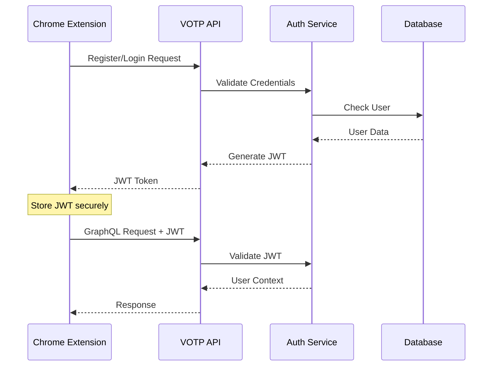

# VOTP API Reference

This document provides comprehensive API documentation for the Voice of the People (VOTP) GraphQL API.

## API Endpoint

**Base URL**: `https://api.votp.example.com/graphql`  
**Development URL**: `http://localhost:8000/graphql`  
**Playground**: `http://localhost:8000/playground`

## Authentication

The VOTP API uses JWT (JSON Web Tokens) for authentication. Include the token in the Authorization header:

```http
Authorization: Bearer <your-jwt-token>
```

### Authentication Flow



## GraphQL Schema

### Types

#### User
```graphql
type User {
  id: ID!
  email: String!
  created_at: DateTime!
  updated_at: DateTime!
}
```

#### Comment
```graphql
type Comment {
  id: ID!
  content: String!
  author_email: String!
  page_url: String!
  parent_id: ID
  created_at: DateTime!
  updated_at: DateTime!
  replies: [Comment!]!
}
```

#### CommentInput
```graphql
input CommentInput {
  content: String!
  page_url: String!
  parent_id: ID
}
```

#### AuthInput
```graphql
input AuthInput {
  email: String!
  password: String!
}
```

#### AuthPayload
```graphql
type AuthPayload {
  token: String!
  user: User!
}
```

### Queries

#### Get Comments
Retrieve comments for a specific page URL.

```graphql
query GetComments($pageUrl: String!) {
  comments(page_url: $pageUrl) {
    id
    content
    author_email
    page_url
    parent_id
    created_at
    updated_at
    replies {
      id
      content
      author_email
      created_at
    }
  }
}
```

**Variables:**
```json
{
  "pageUrl": "https://example.com/article"
}
```

**Response:**
```json
{
  "data": {
    "comments": [
      {
        "id": "1",
        "content": "Great article!",
        "author_email": "user@example.com",
        "page_url": "https://example.com/article",
        "parent_id": null,
        "created_at": "2024-01-15T10:30:00Z",
        "updated_at": "2024-01-15T10:30:00Z",
        "replies": [
          {
            "id": "2",
            "content": "I agree!",
            "author_email": "another@example.com",
            "created_at": "2024-01-15T11:00:00Z"
          }
        ]
      }
    ]
  }
}
```

#### Get User Profile
Retrieve the current user's profile (requires authentication).

```graphql
query GetProfile {
  me {
    id
    email
    created_at
    updated_at
  }
}
```

**Response:**
```json
{
  "data": {
    "me": {
      "id": "123",
      "email": "user@example.com",
      "created_at": "2024-01-01T00:00:00Z",
      "updated_at": "2024-01-01T00:00:00Z"
    }
  }
}
```

### Mutations

#### User Registration
Register a new user account.

```graphql
mutation Register($input: AuthInput!) {
  register(input: $input) {
    token
    user {
      id
      email
      created_at
    }
  }
}
```

**Variables:**
```json
{
  "input": {
    "email": "newuser@example.com",
    "password": "securepassword123"
  }
}
```

**Response:**
```json
{
  "data": {
    "register": {
      "token": "eyJhbGciOiJIUzI1NiIsInR5cCI6IkpXVCJ9...",
      "user": {
        "id": "456",
        "email": "newuser@example.com",
        "created_at": "2024-01-15T12:00:00Z"
      }
    }
  }
}
```

#### User Login
Authenticate an existing user.

```graphql
mutation Login($input: AuthInput!) {
  login(input: $input) {
    token
    user {
      id
      email
    }
  }
}
```

**Variables:**
```json
{
  "input": {
    "email": "user@example.com",
    "password": "userpassword"
  }
}
```

#### Create Comment
Post a new comment (requires authentication).

```graphql
mutation CreateComment($input: CommentInput!) {
  createComment(input: $input) {
    id
    content
    author_email
    page_url
    parent_id
    created_at
  }
}
```

**Variables:**
```json
{
  "input": {
    "content": "This is my comment on the article.",
    "page_url": "https://example.com/article",
    "parent_id": null
  }
}
```

**Response:**
```json
{
  "data": {
    "createComment": {
      "id": "789",
      "content": "This is my comment on the article.",
      "author_email": "user@example.com",
      "page_url": "https://example.com/article",
      "parent_id": null,
      "created_at": "2024-01-15T13:30:00Z"
    }
  }
}
```

#### Create Reply
Reply to an existing comment (requires authentication).

```graphql
mutation CreateReply($input: CommentInput!) {
  createComment(input: $input) {
    id
    content
    author_email
    parent_id
    created_at
  }
}
```

**Variables:**
```json
{
  "input": {
    "content": "Thanks for sharing your thoughts!",
    "page_url": "https://example.com/article",
    "parent_id": "789"
  }
}
```

#### Delete Comment
Delete a comment (requires authentication and ownership).

```graphql
mutation DeleteComment($id: ID!) {
  deleteComment(id: $id)
}
```

**Variables:**
```json
{
  "id": "789"
}
```

**Response:**
```json
{
  "data": {
    "deleteComment": true
  }
}
```

## Error Handling

The API returns errors in the standard GraphQL format:

```json
{
  "errors": [
    {
      "message": "Authentication required",
      "extensions": {
        "code": "UNAUTHENTICATED"
      }
    }
  ],
  "data": null
}
```

### Common Error Codes

| Code | Description | HTTP Status |
|------|-------------|-------------|
| `UNAUTHENTICATED` | Missing or invalid JWT token | 401 |
| `FORBIDDEN` | Insufficient permissions | 403 |
| `BAD_USER_INPUT` | Invalid input data | 400 |
| `INTERNAL_ERROR` | Server error | 500 |
| `NOT_FOUND` | Resource not found | 404 |

### Error Examples

#### Authentication Error
```json
{
  "errors": [
    {
      "message": "Authentication required",
      "extensions": {
        "code": "UNAUTHENTICATED"
      }
    }
  ],
  "data": null
}
```

#### Validation Error
```json
{
  "errors": [
    {
      "message": "Comment content cannot be empty",
      "extensions": {
        "code": "BAD_USER_INPUT",
        "field": "content"
      }
    }
  ],
  "data": null
}
```

#### Permission Error
```json
{
  "errors": [
    {
      "message": "You can only delete your own comments",
      "extensions": {
        "code": "FORBIDDEN"
      }
    }
  ],
  "data": null
}
```

## Usage Examples

### JavaScript/TypeScript

#### Using fetch API

```javascript
// Basic GraphQL request
async function makeGraphQLRequest(query, variables = {}, token = null) {
  const response = await fetch('http://localhost:8000/graphql', {
    method: 'POST',
    headers: {
      'Content-Type': 'application/json',
      ...(token && { 'Authorization': `Bearer ${token}` })
    },
    body: JSON.stringify({
      query,
      variables
    })
  });

  const result = await response.json();
  
  if (result.errors) {
    throw new Error(result.errors[0].message);
  }
  
  return result.data;
}

// Get comments for a page
const comments = await makeGraphQLRequest(`
  query GetComments($pageUrl: String!) {
    comments(page_url: $pageUrl) {
      id
      content
      author_email
      created_at
      replies {
        id
        content
        author_email
        created_at
      }
    }
  }
`, { pageUrl: window.location.href });

// Login user
const authResult = await makeGraphQLRequest(`
  mutation Login($input: AuthInput!) {
    login(input: $input) {
      token
      user {
        email
      }
    }
  }
`, {
  input: {
    email: 'user@example.com',
    password: 'password123'
  }
});

const token = authResult.login.token;
localStorage.setItem('votp_token', token);

// Create comment with authentication
const newComment = await makeGraphQLRequest(`
  mutation CreateComment($input: CommentInput!) {
    createComment(input: $input) {
      id
      content
      created_at
    }
  }
`, {
  input: {
    content: 'My new comment',
    page_url: window.location.href
  }
}, token);
```

#### Using Apollo Client

```javascript
import { ApolloClient, InMemoryCache, gql, createHttpLink } from '@apollo/client';
import { setContext } from '@apollo/client/link/context';

// Create HTTP link
const httpLink = createHttpLink({
  uri: 'http://localhost:8000/graphql',
});

// Create auth link
const authLink = setContext((_, { headers }) => {
  const token = localStorage.getItem('votp_token');
  return {
    headers: {
      ...headers,
      authorization: token ? `Bearer ${token}` : "",
    }
  }
});

// Create Apollo Client
const client = new ApolloClient({
  link: authLink.concat(httpLink),
  cache: new InMemoryCache()
});

// Query examples
const GET_COMMENTS = gql`
  query GetComments($pageUrl: String!) {
    comments(page_url: $pageUrl) {
      id
      content
      author_email
      created_at
      replies {
        id
        content
        author_email
        created_at
      }
    }
  }
`;

const CREATE_COMMENT = gql`
  mutation CreateComment($input: CommentInput!) {
    createComment(input: $input) {
      id
      content
      created_at
    }
  }
`;

// Usage
const { data, loading, error } = useQuery(GET_COMMENTS, {
  variables: { pageUrl: window.location.href }
});

const [createComment] = useMutation(CREATE_COMMENT);
```

### cURL Examples

#### Get Comments
```bash
curl -X POST http://localhost:8000/graphql \
  -H "Content-Type: application/json" \
  -d '{
    "query": "query GetComments($pageUrl: String!) { comments(page_url: $pageUrl) { id content author_email created_at } }",
    "variables": { "pageUrl": "https://example.com" }
  }'
```

#### User Login
```bash
curl -X POST http://localhost:8000/graphql \
  -H "Content-Type: application/json" \
  -d '{
    "query": "mutation Login($input: AuthInput!) { login(input: $input) { token user { email } } }",
    "variables": { "input": { "email": "user@example.com", "password": "password123" } }
  }'
```

#### Create Comment (with authentication)
```bash
curl -X POST http://localhost:8000/graphql \
  -H "Content-Type: application/json" \
  -H "Authorization: Bearer YOUR_JWT_TOKEN" \
  -d '{
    "query": "mutation CreateComment($input: CommentInput!) { createComment(input: $input) { id content created_at } }",
    "variables": { "input": { "content": "My comment", "page_url": "https://example.com" } }
  }'
```

## Rate Limiting

The API implements rate limiting to prevent abuse:

- **Anonymous requests**: 100 requests per hour per IP
- **Authenticated requests**: 1000 requests per hour per user
- **Comment creation**: 10 comments per minute per user

Rate limit headers are included in responses:
```http
X-RateLimit-Limit: 1000
X-RateLimit-Remaining: 999
X-RateLimit-Reset: 1642262400
```

## WebSocket Subscriptions (Future)

*Note: WebSocket subscriptions are planned for future releases*

```graphql
# Planned subscription for real-time comments
subscription CommentAdded($pageUrl: String!) {
  commentAdded(page_url: $pageUrl) {
    id
    content
    author_email
    created_at
  }
}
```

## API Versioning

The VOTP API follows semantic versioning:

- **Current Version**: v1.0.0
- **Version Header**: `API-Version: v1`
- **Deprecation Policy**: 6 months notice for breaking changes

## Performance Considerations

### Query Optimization

1. **Use Field Selection**: Only request fields you need
   ```graphql
   # Good - specific fields
   query GetComments($pageUrl: String!) {
     comments(page_url: $pageUrl) {
       id
       content
       created_at
     }
   }
   
   # Avoid - requesting all fields
   query GetComments($pageUrl: String!) {
     comments(page_url: $pageUrl) {
       id
       content
       author_email
       page_url
       parent_id
       created_at
       updated_at
       replies {
         # ... all fields
       }
     }
   }
   ```

2. **Pagination**: Use pagination for large datasets
   ```graphql
   query GetComments($pageUrl: String!, $limit: Int, $offset: Int) {
     comments(page_url: $pageUrl, limit: $limit, offset: $offset) {
       id
       content
       created_at
     }
   }
   ```

3. **Caching**: Implement client-side caching
   ```javascript
   // Cache comments for 5 minutes
   const cacheKey = `comments:${pageUrl}`;
   const cached = localStorage.getItem(cacheKey);
   
   if (cached && Date.now() - cached.timestamp < 300000) {
     return cached.data;
   }
   ```

### Response Times

- **Simple queries**: < 50ms
- **Complex queries with joins**: < 200ms
- **Mutations**: < 100ms
- **Authentication**: < 30ms

## Security

### Input Validation

All inputs are validated on the server side:

- **Email**: Valid email format required
- **Password**: Minimum 8 characters, must include letters and numbers
- **Comment Content**: Maximum 5000 characters, HTML sanitized
- **URLs**: Valid URL format required

### Content Security Policy

The API supports CSP headers:
```http
Content-Security-Policy: default-src 'self'; script-src 'self' 'unsafe-inline'
```

### CORS Configuration

CORS is configured for browser compatibility:
```http
Access-Control-Allow-Origin: *
Access-Control-Allow-Methods: GET, POST, OPTIONS
Access-Control-Allow-Headers: Content-Type, Authorization
```

## Testing

### GraphQL Playground

Access the interactive playground at `http://localhost:8000/playground` to:
- Explore the schema
- Test queries and mutations
- View documentation
- Debug API calls

### Example Test Suite

```javascript
// Jest test example
describe('VOTP API', () => {
  test('should fetch comments for a page', async () => {
    const query = `
      query GetComments($pageUrl: String!) {
        comments(page_url: $pageUrl) {
          id
          content
        }
      }
    `;
    
    const response = await request(app)
      .post('/graphql')
      .send({ query, variables: { pageUrl: 'https://test.com' } })
      .expect(200);
    
    expect(response.body.data.comments).toBeInstanceOf(Array);
  });
  
  test('should require authentication for creating comments', async () => {
    const mutation = `
      mutation CreateComment($input: CommentInput!) {
        createComment(input: $input) {
          id
        }
      }
    `;
    
    const response = await request(app)
      .post('/graphql')
      .send({
        query: mutation,
        variables: {
          input: { content: 'Test', page_url: 'https://test.com' }
        }
      })
      .expect(200);
    
    expect(response.body.errors[0].extensions.code).toBe('UNAUTHENTICATED');
  });
});
```

---

*This API reference covers all current endpoints and functionality. For implementation details, see the [Architecture Guide](Architecture.md).*