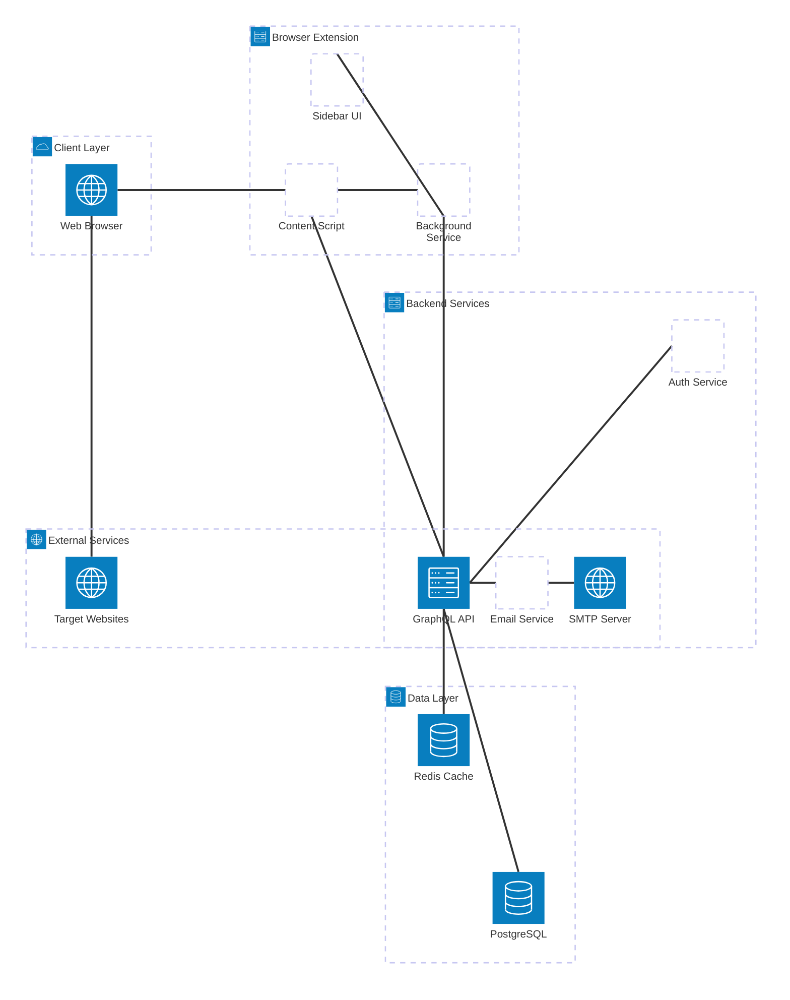
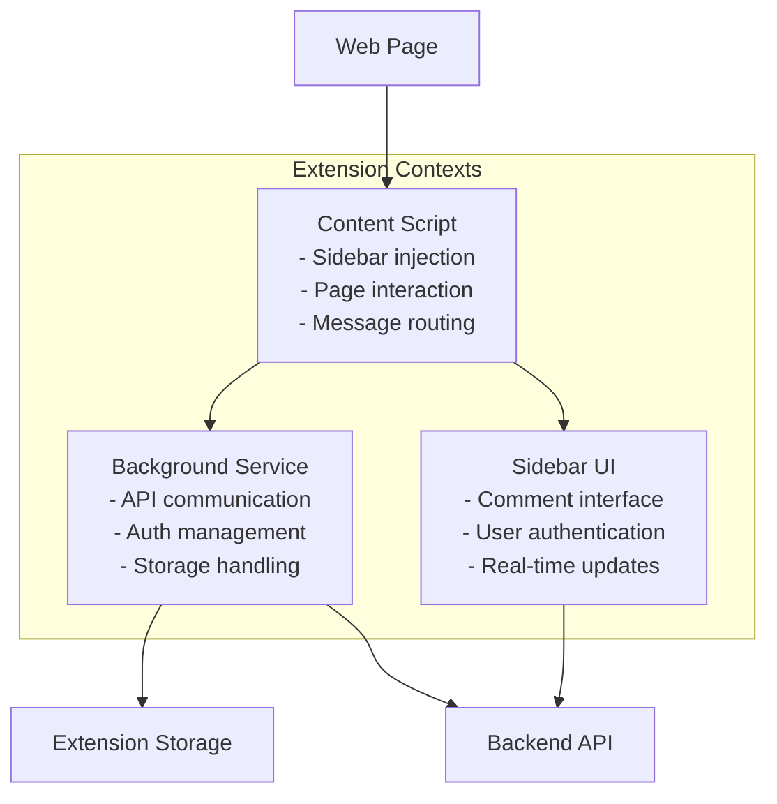
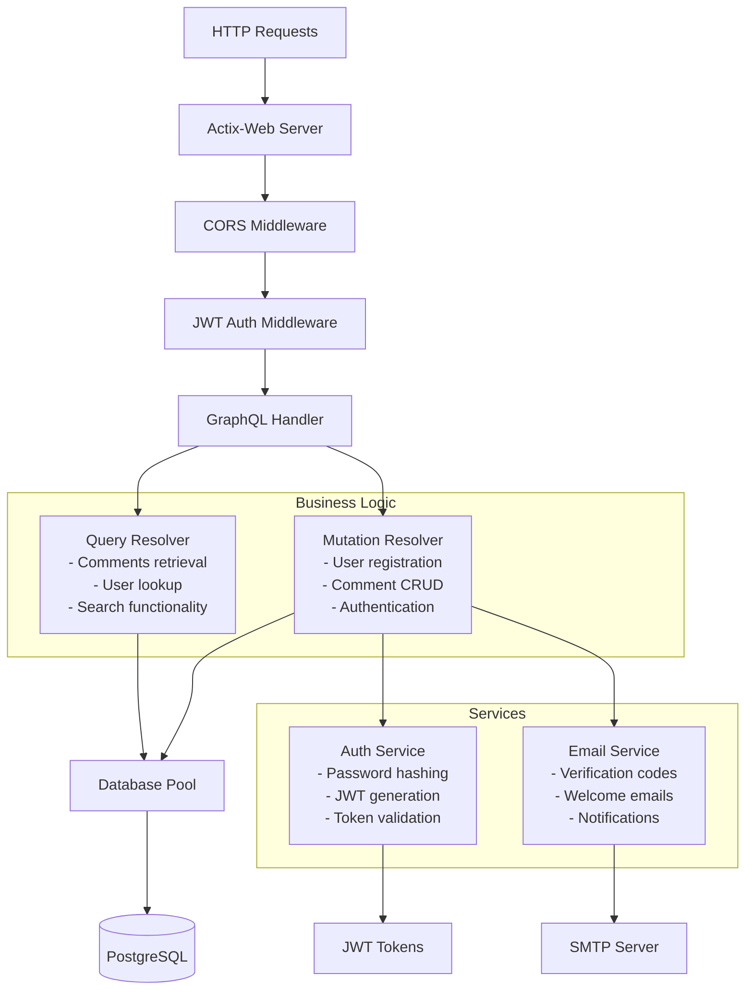
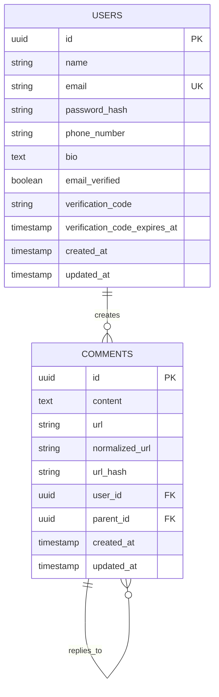
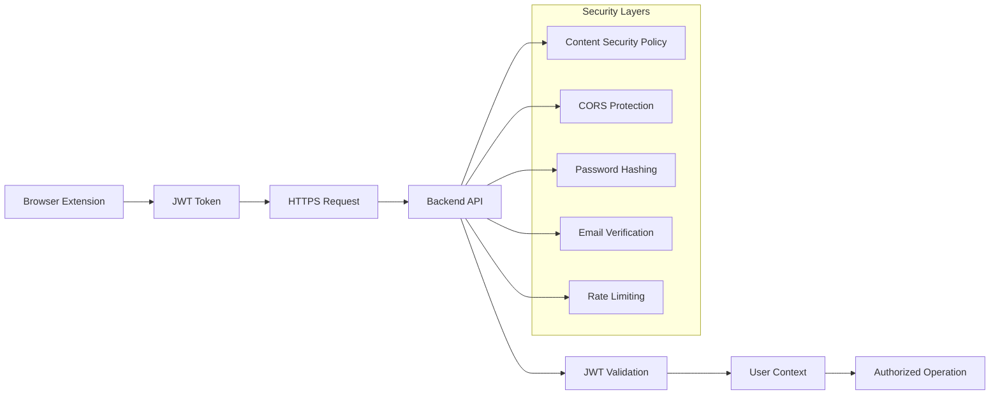
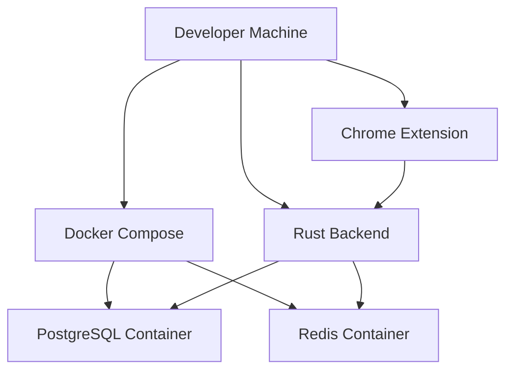
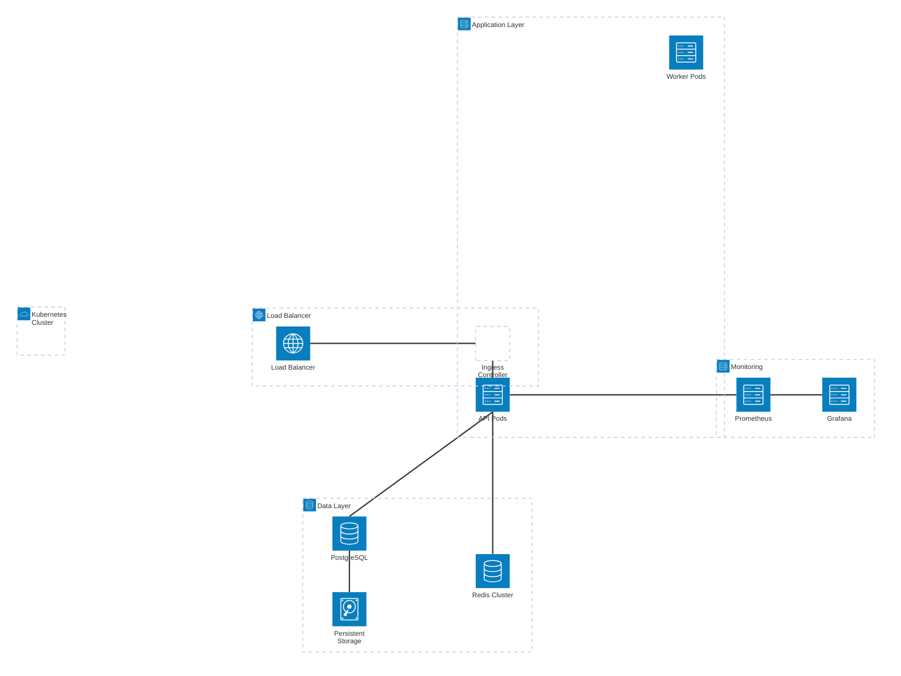
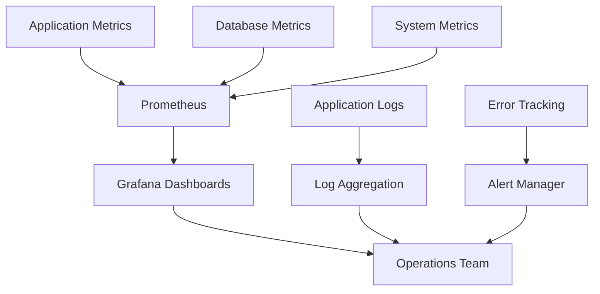
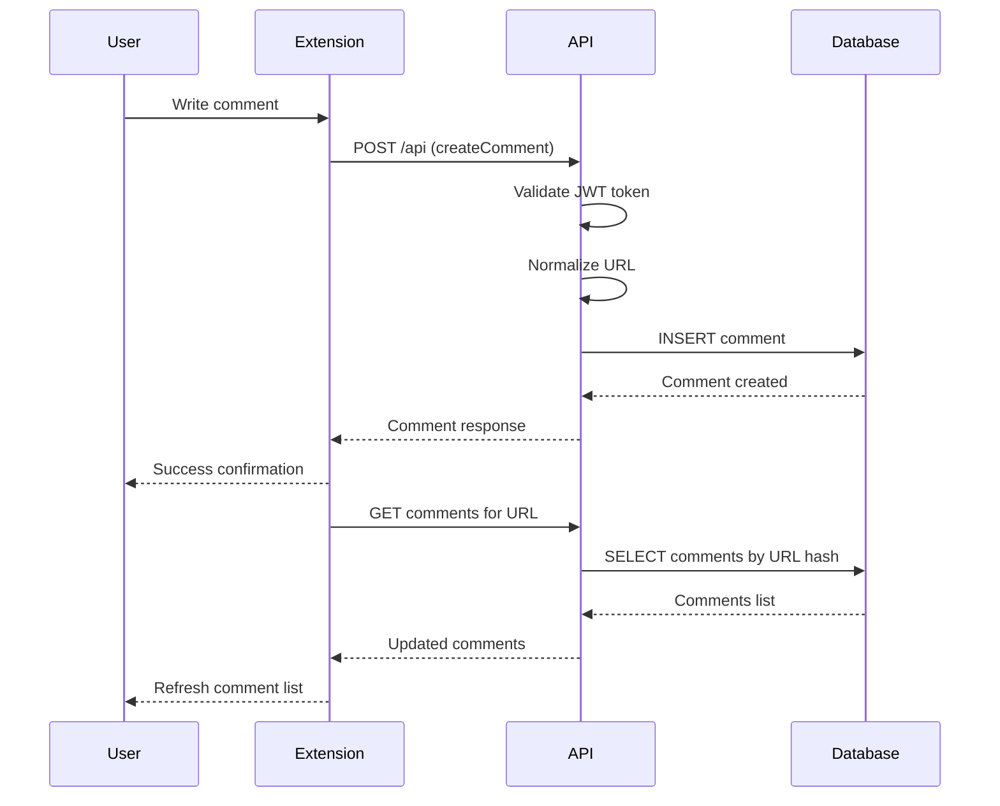
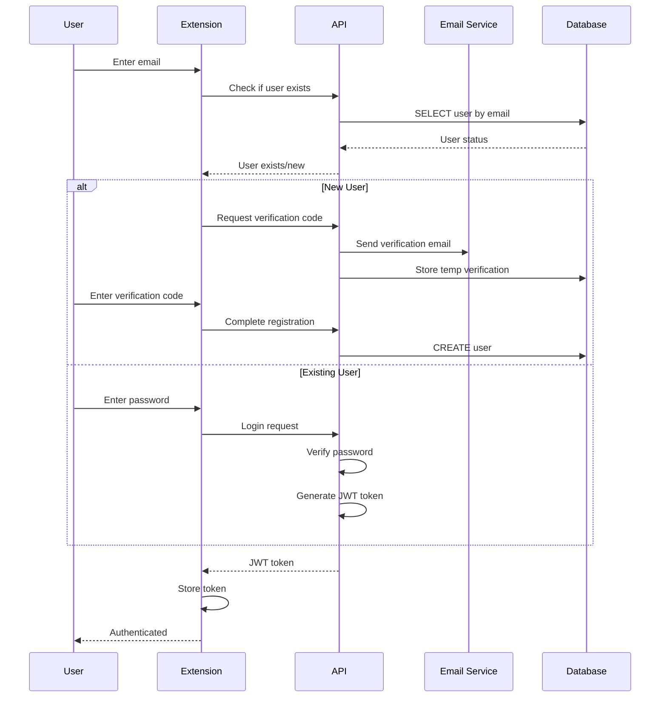

# VOTP System Architecture

## Overview

Voice of the People (VOTP) is a distributed commenting platform that enables users to engage in discussions on any webpage through a Chrome extension. This document provides a comprehensive architectural overview from a solutions architect perspective.

## High-Level Architecture

## Component Architecture

### 1. Browser Extension Layer

The Chrome extension operates across multiple contexts to provide seamless commenting functionality:

**Content Script Responsibilities:**
- Inject commenting sidebar into web pages
- Manage sidebar visibility and positioning
- Route messages between contexts
- Handle extension context validation

**Background Service Worker:**
- Authenticate users with JWT tokens
- Make secure API requests to backend
- Manage extension state and storage
- Handle extension lifecycle events

**Sidebar UI:**
- Provide commenting interface
- Handle user authentication flows
- Display comments for current page
- Manage real-time comment updates

### 2. Backend Services Architecture

The backend is built on a modern Rust stack with GraphQL API:

### 3. Data Architecture

The data layer provides scalable storage and caching:

**Database Design Principles:**
- **UUID Primary Keys**: Scalable, non-sequential identifiers
- **URL Normalization**: Consistent comment grouping across similar URLs
- **Hash Indexing**: Fast comment retrieval by URL
- **Hierarchical Comments**: Support for threaded discussions
- **Soft Constraints**: Flexible schema for future extensions

### 4. Security Architecture

**Security Features:**
- **JWT Authentication**: Stateless token-based auth
- **Password Security**: Argon2 hashing algorithm
- **Email Verification**: Prevent fake account creation
- **CORS Protection**: Controlled cross-origin access
- **CSP Compliance**: Secure extension execution
- **HTTPS Only**: Encrypted data transmission

## Deployment Architecture

### Development Environment

### Production Environment

## Scalability Considerations

### Horizontal Scaling
- **Stateless API**: Multiple backend instances behind load balancer
- **Database Sharding**: Partition comments by URL hash
- **Redis Clustering**: Distributed caching for session management
- **CDN Integration**: Static asset delivery optimization

### Performance Optimization
- **Connection Pooling**: Efficient database connections
- **Query Optimization**: Indexed searches and joins
- **Caching Strategy**: Redis for frequently accessed data
- **Async Processing**: Non-blocking I/O operations

### Monitoring and Observability

## Technology Stack

### Frontend (Chrome Extension)
- **Language**: JavaScript (ES2020+)
- **Manifest**: V3 for modern Chrome extensions
- **UI Framework**: Vanilla JS with modern CSS
- **Build Process**: Native browser APIs, no bundling required

### Backend Services
- **Language**: Rust (2021 Edition)
- **Web Framework**: Actix-Web 4.x
- **GraphQL**: async-graphql 7.x
- **Database**: SQLx with PostgreSQL driver
- **Authentication**: jsonwebtoken + Argon2
- **Email**: lettre with native-tls

### Data Layer
- **Primary Database**: PostgreSQL 15+
- **Caching**: Redis 7+
- **Migrations**: SQLx migrations
- **Connection Pooling**: SQLx connection pool

### Infrastructure
- **Containerization**: Docker + Docker Compose
- **Orchestration**: Kubernetes (production)
- **Reverse Proxy**: Nginx Ingress Controller
- **Monitoring**: Prometheus + Grafana
- **CI/CD**: GitHub Actions (future)

## Data Flow Patterns

### Comment Creation Flow

### User Authentication Flow

## Integration Points

### Chrome Extension APIs
- **Storage API**: Token and user data persistence
- **Tabs API**: URL detection and page management
- **Runtime API**: Inter-context messaging
- **WebRequest API**: Request interception (future)

### External Services
- **SMTP Server**: Email delivery service
- **OAuth Providers**: Future social login integration
- **CDN Services**: Static asset delivery
- **Analytics**: Usage tracking and insights

## Future Architecture Considerations

### Planned Enhancements
- **Real-time Updates**: WebSocket connections for live comments
- **Content Moderation**: AI-powered content filtering
- **Mobile App**: React Native companion app
- **Social Features**: User profiles and following
- **Analytics Dashboard**: Comment engagement metrics

### Scalability Roadmap
- **Microservices**: Break monolith into specialized services
- **Event Sourcing**: Audit trail and state reconstruction
- **CQRS Pattern**: Separate read/write optimizations
- **Global Distribution**: Multi-region deployment strategy

---

*This architecture document reflects the current system design and is updated with major architectural changes.*